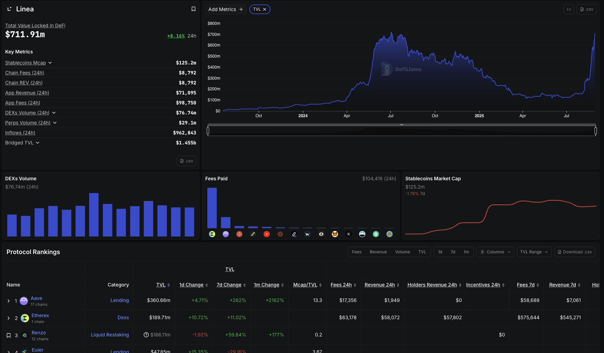

# Etherex Adoption Analysis
Beyond Volume Metrics - Tracking real activity metrics on Linea's fastest-rising Decentralised Exchange (DEX)


## Table of Contents

1. [Introduction](#1-introduction)
2. [Dashboard Overview](#2-dashboard-overview)
3. [Methodology](#3-methodology)
4. [Data Sourcing & Frameworks](#4-data-sourcing--frameworks)
5. [Key Insights](#5-Key-insights)
6. [Challenges](#6-challenges)
7. [Resources](#7resources)
  
## 1. Introduction
### Project Overview
 
Welcome to the Etherex Dashboard, a comprehensive analytics tool tracking real user engagement on Etherex, Linea's native DEX, while filtering out bot manipulation or superficial activity.

#### Why Linea & Etherex
**Linea**: ConsenSys’ zkEVM rollup has seen rising TVL, reflecting increased usage, though revenue and fees remain modest. This mixed picture makes Linea an interesting ecosystem to examine adoption quality and user activity.

**Etherex**: One of the leading native DEXs on Linea by TVL and activity, Etherex stands out for its innovative tokenomics and trading ecosystem.


*Total Value Locked (TVL) for Linea (L2) and Etherex (DEX), showing growth in assets under management.*  
Source:  [DefiLlama](https://defillama.com/protocol/dexs/etherex)


#### What Makes Etherex Unique
* 100% fee distribution: all trading fees go to stakers
* 100% liquidity rewards: all rewards go to Liquidity Providers, no team cuts
* REX incentives: LPs earn REX, which can be staked as xREX for governance and fee sharing

This analysis explores real, actionable metrics in a fast-growing ecosystem, providing insights into both protocol health and broader L2 adoption trends.
Sources: [Blockworks](https://blockworks.co/news/linea-previews-eth-first-roadmap) / [Cointelegraph](https://cointelegraph.com/news/consensys-launches-linea-zk-evm-to-scale-ethereum) / [Etherex Twitter](https://x.com/etherexfi/status/1947132627737309399)

*You can also read the full research report on Notion **here** (link).*

## 2. Dashboard Overview
The Etherex Dashboard provides a structured view of the protocol’s performance within the Linea ecosystem. Charts are created for different stakeholder audiences — **Protocol Teams, Advisors, and Users** — to deliver actionable insights.

Data is sourced from **Dune Analytics** and presented with a balance of technical accuracy and strategic interpretation.

| Dashboard Sections    | Charts                                                       | Audience / Purpose |
| -------------------- | ------------------------------------------------------------ | ------------------ |
| Protocol Performance | Daily REX Staking, Emission Effectiveness, Staking-to-Swap   | Protocol Teams     |
| User Behaviour        | User Quality Analysis (REX), User Leaderboard with Anti-Bot Weighted Scoring                     | Advisors / Users   |
| Trading & Adoption   | Top Trading Pairs by Activity Score, Adoption & Sustainability Metrics | Advisors / Users   |


**You can access the full dashboard [here](https://dune.com/kukumaster/etherex).**

### Chart Descriptions

- **Daily REX Staking** – Monitors staking adoption and conversion to xREX. Question answered: `Are users actively staking and converting REX to xREX?`
- **Emission Effectiveness** – Compares staking to DEX activity to measure incentive efficiency. Question answered: `Are staking incentives translating into trading activity?` 
- **Staking-to-Swap Time Lag** – Tracks how quickly staking translates into swaps. Question answered: `How fast do stakers engage with the DEX after staking?`
- **User Quality Analysis (REX Holders)** – Distinguishes real vs. bot users among REX token holders. Question answered: `Which users are the most active and engaged on Etherex?`
- **User Leaderboard with Anti-Bot Weighted Scoring** – Ranks users by a weighted score factoring in activity quality and bot adjustments.
Question answered: `Who are the most consistently active and engaged users on Etherex, accounting for quality of activity rather than just raw trade volume?`
- **Top Trading Pairs by Activity Score** – Evaluates each pool’s activity using a combined metric of unique trades, gas spent, and number of unique traders.
Question answered: `Which trading pairs are generating the most meaningful engagement, considering both volume and user diversity?` 
- **Etherex Adoption & Sustainability Metrics** – Aggregated adoption, retention, and sustainability indicators. Question answered: `Is Etherex adoption growing in a sustainable way?`

By structuring the dashboard around Etherex stakeholders and ecosystem context, the data serves internal teams, external advisors, and end-users alike, making it easier to connect operational mechanics with strategic growth signals.

## 3. Methodology
This section explains how data is processed and analysed, and how the metrics in the Etherex Dashboard are defined.

### Data Collection Process

#### Main Contract Addresses:
 - `0xefd81eec32b9a8222d1842ec3d99c7532c31e348` - REX token 
 - `0xc93B315971A4f260875103F5DA84cB1E30f366Cc` - xREX Staking
 - `0x5C1Bf4B7563C460282617a0304E3cDE133200f70` - WETH/REX DEX POOL

#### Processing & Filtering:
 - ERC‑20 token transfers filtered by amount and sender (ignoring null addresses).
 - Bot/farmer detection using thresholds for transaction frequency, activity span, and average transfer size.
 - Aggregation by wallet, day, and activity type.

#### Metrics Aggregation:
 - Token transfers → total sent, average transfer size, unique counterparties, activity span.
 - DEX swaps → trade counts, active days, pairs traded, activity span.


### Chart & Analysis Logic

| Chart                                     | What it Measures                          | Purpose / Relevance            | Metrics Used                                                                                       | Notes / Caveats                                    |
| ----------------------------------------- | ----------------------------------------- | ------------------------------ | -------------------------------------------------------------------------------------------------- | -------------------------------------------------- |
| Daily REX Staking                         | Total staked REX per day                  | Monitor staking adoption       | `daily_staked`, `staking_transactions`                                                             | Shows scale of incentive participation             |
| Emission Effectiveness                    | How staking correlates with DEX activity  | Measure incentive efficiency   | `unique_daily_stakers`, `unique_daily_traders`, `trader_to_staker_ratio`, `swaps_per_staked_token` | Higher ratios indicate incentives driving trading  |
| Staking-to-Swap Time Lag                  | Time between staking and swap per user    | Evaluate speed of engagement   | `min_time_lag`, `median_time_lag`, `p90/p99_time_lag`                                              | Reflects user responsiveness to staking incentives |
| User Quality Analysis                     | Real vs. bot users                        | Distinguish genuine adoption   | Classification based on activity span, transaction counts, avg transfer size, burstiness           | Highlights sustainable vs inflated participation   |
| User Leaderboard                          | User ranking by activity and volume       | Identify top contributors      | `total_sent`, `total_trades`, `active_days`                                                        | Useful for monitoring high-value participants      |
| Top Trading Pairs by Activity Score       | Most active pairs on Etherex              | Monitor liquidity distribution | `trade_count`, `activity_score`                                                                    | Indicates concentration vs. diversified trading     |
| Etherex Adoption & Sustainability Metrics | Aggregated adoption and retention metrics | Macro-level protocol health    | `unique_users`, `active_days`, `total_volume`                                                      | Combines engagement and economic activity          |


Notes: 
The methodology is designed to balance economic significance and behavioural activity. Metrics and classifications (e.g., Dust Bots, High-Frequency Bots) are chosen to reflect genuine participation and incentive effectiveness.

### Metrics & Analysis Logic (Example SQL Queries)
#### **User Quality Segmentation**

This query classifies REX token wallets into activity-based groups to show whether adoption of Etherex’s native token is driven by genuine user behaviour or bots/incentive farming. Since REX transfers primarily reflect staking and reward activity, this view highlights the quality of participation in Etherex’s token economy.

```sql 
WITH wallet_activity AS (
  SELECT 
    from_address AS wallet,
    COUNT(*) AS total_transactions,
    COUNT(DISTINCT DATE_TRUNC('day', block_time)) AS active_days,
    SUM(bytearray_to_uint256(data) / 1e18) AS total_sent,
    COUNT(DISTINCT to_address) AS unique_recipients,
    DATE_DIFF('day', MIN(block_time), MAX(block_time)) AS activity_span_days
  FROM linea.logs
  WHERE contract_address = 0xefd81eec32b9a8222d1842ec3d99c7532c31e348 -- REX token
    AND topic0 = 0xddf252ad1be2c89b69c2b068fc378daa952ba7f163c4a11628f55a4df523b3ef -- Transfer event
    AND from_address != 0x0000000000000000000000000000000000000000
  GROUP BY from_address
)
SELECT wallet,
  CASE
    WHEN total_transactions > 1000 THEN 'Bot: High Frequency'
    WHEN activity_span_days > 7 AND active_days > 3 THEN 'Likely Genuine User'
    WHEN total_sent > 1000 AND unique_recipients > 2 THEN 'Power User'
    ELSE 'Regular User'
  END AS user_type
FROM wallet_activity;

```

This query applies the Active Address Segmentation Framework:
 - **Bots (High Frequency)**: Wallets with extreme transaction counts.
 - **Power Users**: Large cumulative transfers with multiple unique recipients.
 - **Likely Genuine Users**: Sustained activity across multiple days.
 - **Regular Users**: Remaining low-activity wallets.

 By classifying wallets on these rules, the segmentation framework offers a clear, data-driven perspective on which participants drive token activity. This approach distinguishes between automated trading, highly engaged users, and baseline participants, allowing a more nuanced understanding of real adoption beyond headline metrics.

| Rule                                          | Classification      | Reasoning                                            |
| --------------------------------------------- | ------------------- | ---------------------------------------------------- |
| `total_transactions > 1000`                   | Bot: High Frequency | Likely automated activity                            |
| `activity_span_days > 7 AND active_days > 3`  | Likely Genuine User | Sustained engagement over time                       |
| `total_sent > 1000 AND unique_recipients > 2` | Power User          | Large-volume users interacting with multiple wallets |
| Else                                          | Regular User        | Default category for low activity                    |


Wallet segmentation by type helps reveal each group’s impact on both userbase size and overall transaction volumes:

 | User Type           | Wallet % | Volume % |
| ------------------- | -------- | -------- |
| Bot: High Frequency | 1%      | 26%       |
| Power User          | 3%       | 3%      |
| Likely Genuine User | 17%      | 62%      |
| Regular User        | 80%      | 8%       |

**Key takeaway**: While some bot activity exists, most REX token volume (62%) comes from genuine users, suggesting real adoption within Etherex’s token economy.

#### **User Leaderboard with Anti-bot** (User Scoring Calculation )

This query produces a user leaderboard using a weighted scoring system to down-rank bots while boosting consistent, active human traders. The user score weights multiple behaviour signals to distinguish real, active users from bots. It combines penalties and bonuses multiplicatively as follows:

Bot Penalties reduce scores for suspicious patterns such as:
 - High trades per block (over 5 or 10 trades)
 - Very short time between trades (less than 60 seconds)
 - Extremely high total trades (over 500)
 - High trade volume, but short active days (trades > 200 with active days < 3)

Human Bonuses increase scores for attributes such as:
 - Greater number of active days (e.g. 6+ days)
 - Moderate number of total trades (10 to 100)
 - Longer average time between trades (over 300 seconds)
 - Gas Quality Multipliers increase scores for users spending meaningful gas (ETH) on trade fees.

The final weighted score is:
`weighted_score = total_trades × active_days × bot_penalty_multiplier × human_bonus_multiplier × gas_quality_multiplier`

```sql
WITH scoring_system AS (
    SELECT
        user_address,
        total_trades,
        active_days,
        COALESCE(total_gas_eth, 0) AS total_gas_eth,
        -- Bot penalties
        (1
          * CASE WHEN max_trades_per_block > 10 THEN 0.1 ELSE 1 END
          * CASE WHEN avg_seconds_between_trades < 60 THEN 0.2 ELSE 1 END
          * CASE WHEN total_trades > 500 THEN 0.1 ELSE 1 END
        ) AS bot_penalty_multiplier,
        -- Human bonuses
        (1
          * CASE WHEN active_days >= 6 THEN 1.8 ELSE 1 END
          * CASE WHEN total_trades BETWEEN 10 AND 100 THEN 1.2 ELSE 1 END
        ) AS human_bonus_multiplier,
        -- Gas quality multipliers
        (1
          * CASE WHEN total_gas_eth > 0.01 THEN 1.5 ELSE 1 END
          * CASE WHEN total_gas_eth > 0.005 THEN 1.2 ELSE 1 END
        ) AS gas_quality_multiplier
    FROM user_behavior
    LEFT JOIN user_fees USING (user_address)
)
SELECT
    user_address,
    total_trades,
    active_days,
    total_gas_eth,
    -- Final weighted score
    total_trades * active_days * bot_penalty_multiplier * human_bonus_multiplier * gas_quality_multiplier AS weighted_score
FROM scoring_system
ORDER BY weighted_score DESC
LIMIT 100;
```

#### **Staking-to-Swap Time Lag**
This query calculates the minimum absolute time difference in minutes between staking and swap events per user, filtering for pairs of events happening within ±30 days:

```sql 
time_lags AS (
  SELECT s.user_address,
         MIN(ABS(DATE_DIFF('minute', s.stake_time, w.swap_time))) AS min_time_lag_minutes
  FROM staking_users s
  JOIN swap_users w ON s.user_address = w.user_address
  WHERE DATE_DIFF('day', s.stake_time, w.swap_time) BETWEEN -30 AND 30
  GROUP BY s.user_address
)
```

#### **Emission Effectiveness**
This query measures how well **REX staking emissions** are translating into real trading activity and user engagement. It links daily staking events to Etherex DEX swaps and produces two key effectiveness ratios:
- **Swaps per Staked Token**: How much trading activity is generated for each REX token staked on a given day. A higher value means emissions are stimulating more protocol usage per unit of staking.  
- **Trader-to-Staker Ratio**: The number of unique traders relative to unique stakers per day. This shows whether staking activity is broadening into market participation (traders) or staying siloed among a few stakers.  

By combining staking and swap data, this framework highlights whether incentives are driving genuine liquidity and trading activity, or just attracting passive staking without downstream engagement.

```sql
-- Effectiveness ratios
CASE 
    WHEN s.daily_staked > 0 THEN v.daily_swaps / s.daily_staked 
    ELSE 0 
END AS swaps_per_staked_token,

CASE 
    WHEN s.unique_daily_stakers > 0 THEN v.unique_daily_traders / s.unique_daily_stakers 
    ELSE 0 
END AS trader_to_staker_ratio
```

## 4. Data Sourcing & Frameworks

**Data Sourcing**: 
This project combines both primary blockchain data and secondary industry references to ensure reliability and independence:

a. Primary Data (On-chain metrics sourced from):
 - Dune SQL: Querying events, transfers, and swap activity.
 - Contract addresses via block explorers: Direct mapping of Etherex’s core contracts (REX, xREX staking, WETH/REX pool).

b. Secondary data (Contextual)
- DefiLlama & Token Terminal: TVL, volume, revenue comparisons across ecosystems.
- Project announcements & industry media (Blockworks, Cointelegraph, etc.): Validating incentive programs and adoption narratives.

This layered approach ensures adoption metrics are accurate and reflect real user activity.

**Frameworks**: 

To move beyond surface-level activity metrics, the analysis applies structured frameworks designed to separate signal from noise in on-chain activity:
- **Active Address Segmentation** – a reusable methodology that classifies users into categories (e.g., Power Users, Farmers, High-Frequency Bots) based on activity span, transaction frequency, and behavioural patterns.
- **Incentive Effectiveness Framework** – links staking activity to downstream trading engagement, providing a view on how efficiently token incentives translate into real protocol usage.
- **Adoption & Sustainability Metrics** – measures retention, concentration, and liquidity distribution to evaluate whether growth reflects sustainable adoption rather than short-term farming.

## 5. Key Insights

#### Protocol Health

- **Staking Adoption**: Surge in first two weeks post-launch, followed by stabilization. This suggests incentive front-loading successfully bootstrapped activity, but growth now relies on organic drivers.
- **Emission Effectiveness**: Rewards initially correlated strongly with trading activity; over time, staking growth outpaced swaps → indicating incentives attract liquidity, but not all stakers remain active traders.
- **Staking-to-Swap Time Lag**: Most users engage fairly quickly after staking, but there’s a small group with very long delays. This indicates that while incentives are effective for the majority, a minority of staked capital remains idle for extended periods.
   * 50th percentile: Users swapped within minutes to hours after staking.
   * 90th percentile: ~1.7 days delay (~2,400 minutes).
   * 99th percentile: ~14 days delay (~20,000 minutes).

      This mix shows incentives are effective for most, but a subset represents passive or speculative engagement.


#### User Behaviour

- **User Quality Analysis (Real vs. Bots)**: – ~65% of trading activity comes from genuine users, 35% from automated or bot-like accounts, indicates a healthy balance of authentic adoption while highlighting the need for monitoring. A subset of high-volume, diverse-wallet interactors drive the majority of sustainable activity, serving as the backbone of user engagement.
- **Anti-bot Scoring**: Behavioural scoring highlights that "Quality Users" consistently outperform high-frequency bots in long-term engagement and gas expenditure. 


#### Adoption & Sustainability

Etherex is gaining unique users steadily but daily actives plateau around ~250–300, showing early signs of stickiness despite incentive-driven entry.
- Trading pair concentration: WETH/REX dominates → protocol risk if liquidity not diversified.
Retention curve shows meaningful stickiness among first-wave users.
- Sustainability: Engagement is holding, but long-term sustainability depends on a variery of factors.

#### **Summary**:
Analysis of Etherex's on-chain metrics reveals encouraging signs of authentic user engagement, though further investigation is needed to definitively assess growth sustainability. The Protocol Performance charts indicate that staking adoption has stabilised after the initial surge, while User Behaviour analysis shows a solid base of consistent traders alongside some reward-driven activity. Trading & Adoption Metrics highlight concentrated yet diverse activity in top pairs and moderate retention over time.

While core metrics suggest a foundation for organic development rather than purely artificial volume inflation, the mixed effectiveness of incentive mechanisms and presence of reward-seeking behaviour warrant continued monitoring. The data provides a baseline for authentic engagement, but longer observation periods and additional behavioural analysis would strengthen conclusions about Etherex's trajectory on Linea.

## 6. Challenges

#### a. Data Gaps

 - **Incomplete ABIs**: New contracts (FeeCollector, Pair contracts) not fully decoded → fee amounts unavailable.
 - **Limited History**: Only ~28 days of data in current tables.
 - **Missing Metadata**: Token-specific details (decimals, USD values) not exposed in Dune logs.

#### b. Methodological Workarounds

- Event Counting: Used number of FeesCollected events as a proxy for activity.
- Bot Filtering: Applied thresholds on transaction frequency and activity span to identify likely bots.
- Python Decoding: Experimented with ABI-based log parsing to reconstruct USD volumes outside Dune.

#### c. Future Work
- Upgrade queries once ABIs decoded.
- Add external validation pipeline (Linea API, BigQuery) to strengthen independence.
- Expand analysis once >3 months of data is available.

## 7. Resources
[Blockworks](https://blockworks.co/news/linea-previews-eth-first-roadmap) |
[Cointelegraph](https://cointelegraph.com/news/consensys-launches-linea-zk-evm-to-scale-ethereum) |
[DefiLlama](https://defillama.com/protocol/dexs/etherex) |
[DEXScreener](https://dexscreener.com/linea/0x5c1bf4b7563c460282617a0304e3cde133200f70) |
[Dune Docs](https://docs.dune.com/home) |
[Etherex Docs](https://docs.etherex.finance/) |
[Linea Docs](https://docs.linea.build/technology/canonical-token-bridge) |
[Linea official](https://linea.build/) |
[Linea Block Explorer](https://lineascan.build/) |
[Token Terminal](https://tokenterminal.com/explorer/projects/linea/metrics/all)


Credit goes to some AI tools (Claude AI, ChatGPT & Perplexity) for assistance in drafting, structuring, and refining content and SQL queries for this report and the Etherex dashboard.


