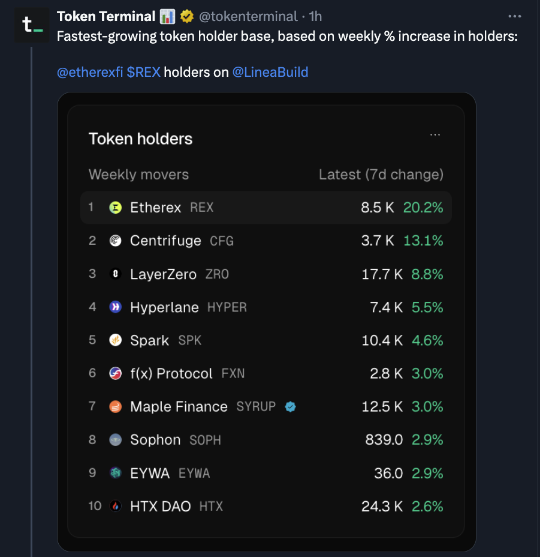

# Etherex Adoption Analysis
Beyond Volume Metrics - Tracking real activity metrics on Linea's fastest-rising Decentralised Exchange (DEX)


## Table of Contents

1. [Introduction](#introduction)
2. [Dashboard Overview](#dashboard-overview)
3. [Methodology](#methodology)
4. [Data Sourcing & Frameworks](#data-sourcing--frameworks)
5. [Key Insights](#Key-insights)
6. [Challenges](#challenges)
7. [Resources & References](#resources--references)
  
## 1. Introduction
### Project Overview

Welcome to the Etherex Dashboard, a comprehensive analytics tool examining genuine user engagement on Etherex, Linea's native DEX, while filtering out bot manipulation and vanity metrics.

#### Why Linea & Etherex
**Linea**: ConsenSys’ zkEVM rollup has seen rising TVL, reflecting increased usage, though revenue and fees remain modest. This mixed picture makes Linea an interesting ecosystem to examine adoption quality and user activity.

**Etherex**: One of the leading native DEXs on Linea by TVL and activity, Etherex stands out for its innovative tokenomics and trading ecosystem. Fastest token holder base, according to Token Terminal.



#### What Makes Etherex Unique
* 100% fee distribution → All trading fees to stakers
* 100% liquidity rewards → All rewards goes to Liquidy Providers, no team cuts
* REX flywheel → LPs earn REX → Stake as xREX for governance + fee sharing


This analysis explore real, actionable metrics in a fast-growing ecosystem, providing insights into both protocol health and broader L2 adoption trends.


Sources: [Blockworks](https://blockworks.co/news/linea-previews-eth-first-roadmap) / [Cointelegraph](https://cointelegraph.com/news/consensys-launches-linea-zk-evm-to-scale-ethereum) / [DefiLlama](https://defillama.com/protocol/dexs/etherex) / [Etherex Twitter](https://x.com/etherexfi/status/1947132627737309399)

## 2. Dashboard Overview
The Etherex Dashboard provides a structured view of the protocol’s performance within the Linea ecosystem. Charts are created for different stakeholder audiences — **Protocol Teams, Advisors, and Users** — to deliver actionable insights.

Data is sourced from **Dune Analytics** and presented with a balance of technical accuracy and strategic interpretation.

| Dashboard Sections    | Charts                                                       | Audience / Purpose |
| -------------------- | ------------------------------------------------------------ | ------------------ |
| Protocol Performance | Daily REX Staking, Emission Effectiveness, Staking-to-Swap   | Protocol Teams     |
| User Behaviour        | User Quality Analysis, User Leaderboard                      | Advisors / Users   |
| Trading & Adoption   | Top Trading Pairs, Etherex Adoption & Sustainability Metrics | Advisors / Users   |


**You can access the full dashboard [here](https://dune.com/kukumaster/etherex).**

### Chart Descriptions

- **Daily REX Staking** – Monitors staking adoption and conversion to xREX. Useful for protocol teams to assess incentive uptake.  
- **Emission Effectiveness** – Compares staking to DEX activity to measure incentive efficiency. Mainly for protocol teams.  
- **Staking-to-Swap Time Lag** – Tracks how quickly staking translates into swaps, showing incentive effectiveness. Protocol-focused.  
- **User Quality Analysis** – Distinguishes real vs. bot users, useful for subscribers and protocols to understand genuine adoption.  
- **User Leaderboard** – Ranks users by activity and volume; relevant for subscribers and protocol teams tracking engagement.  
- **Top Trading Pairs by Activity Score** – Shows the most active trading pairs; mainly for protocol teams to monitor liquidity.  
- **Etherex Adoption & Sustainability Metrics** – Aggregated adoption, retention, and sustainability indicators; valuable for advisors, protocol teams, and users.

By structuring the dashboard around Etherex stakeholders and ecosystem context, the data serves internal teams, external advisors, and end-users alike, making it easier to connect operational mechanics with strategic growth signals.

## 3. Methodology
This section explains how data is processed and analysed, and how the metrics in the Etherex Dashboard are defined.

### 1. Data Collection Process
Data is sourced from Dune Analytics and websites (Twitter posts, Block explorer)? Maybe I will add API too...

#### Main Contract Addresses:
 - `0xefd81eec32b9a8222d1842ec3d99c7532c31e348` - REX token 
 - `0xc93B315971A4f260875103F5DA84cB1E30f366Cc` - xREX Staking
 - `0x5C1Bf4B7563C460282617a0304E3cDE133200f70` - WETH/REX DEX POOL

#### Processing & Filtering:
 - ERC‑20 token transfers filtered by amount and sender (ignoring null addresses).
 - Bot/farmer detection using thresholds for transaction frequency, activity span, and average transfer size.
 - Aggregation by wallet, day, and activity type.

#### Metrics Aggregation:
 - Token transfers → total sent, average transfer size, unique counterparties, activity span.
 - DEX swaps → trade counts, active days, pairs traded, activity span.


### 2. Chart & Analysis Logic

| Chart                                     | What it Measures                          | Purpose / Relevance            | Metrics Used                                                                                       | Notes / Caveats                                    |
| ----------------------------------------- | ----------------------------------------- | ------------------------------ | -------------------------------------------------------------------------------------------------- | -------------------------------------------------- |
| Daily REX Staking                         | Total staked REX per day                  | Monitor staking adoption       | `daily_staked`, `staking_transactions`                                                             | Shows scale of incentive participation             |
| Emission Effectiveness                    | How staking correlates with DEX activity  | Measure incentive efficiency   | `unique_daily_stakers`, `unique_daily_traders`, `trader_to_staker_ratio`, `swaps_per_staked_token` | Higher ratios indicate incentives driving trading  |
| Staking-to-Swap Time Lag                  | Time between staking and swap per user    | Evaluate speed of engagement   | `min_time_lag`, `median_time_lag`, `p90/p99_time_lag`                                              | Reflects user responsiveness to staking incentives |
| User Quality Analysis                     | Real vs. bot users                        | Distinguish genuine adoption   | Classification based on activity span, transaction counts, avg transfer size, burstiness           | Highlights sustainable vs inflated participation   |
| User Leaderboard                          | User ranking by activity and volume       | Identify top contributors      | `total_sent`, `total_trades`, `active_days`                                                        | Useful for monitoring high-value participants      |
| Top Trading Pairs by Activity Score       | Most active pairs on Etherex              | Monitor liquidity distribution | `trade_count`, `activity_score`                                                                    | Indicates concentration vs diversified trading     |
| Etherex Adoption & Sustainability Metrics | Aggregated adoption and retention metrics | Macro-level protocol health    | `unique_users`, `active_days`, `total_volume`                                                      | Combines engagement and economic activity          |


Notes

The methodology is designed to balance economic significance and behavioural activity.
Metrics and classifications (e.g., Dust Bots, High-Frequency Bots) are chosen to reflect genuine participation and incentive effectiveness.

## 4. Data Sourcing and Frameworks

**Data Sourcing**: 
This project combines both primary blockchain data and secondary industry references to ensure reliability and independence:

1. Primary Data (On-chain metrics sourced from):
 - Dune SQL → querying events, transfers, and swap activity.
 - Contract addresses via block explorers → direct mapping of Etherex’s core contracts (REX, xREX staking, WETH/REX pool).
 - API? 

2. Secondary data (Contextual)
- DefiLlama & Token Terminal: TVL, volume, revenue comparisons across ecosystems.
- Project announcements & industry media (Blockworks, Cointelegraph, etc.): Validating incentive programs and adoption narratives.

This layered sourcing approach ensures adoption metrics are both technically accurate and contextually grounded.

**Frameworks**: 

To move beyond surface-level activity metrics, the analysis applies structured frameworks designed to separate signal from noise in on-chain activity:
- **Active Address Segmentation for L2 Protocols** – a reusable methodology that classifies users into categories (e.g., Power Users, Farmers, High-Frequency Bots) based on activity span, transaction frequency, and behavioral patterns.
- **Incentive Effectiveness Framework** – links staking activity to downstream trading engagement, providing a view on how efficiently token incentives translate into real protocol usage.
- **Adoption & Sustainability Metrics** – measures retention, concentration, and liquidity distribution to evaluate whether growth reflects sustainable adoption rather than short-term farming.

### SQL Example SQL Queries
#### User Quality Segmentation

This query classifies Etherex users into activity-based cohorts. The framework is reusable across L2 protocols to separate genuine adoption from wash trading or bot inflation.

```sql -- User Segmentation Framework: Classifying Etherex wallets
WITH wallet_activity AS (
  SELECT 
    from_address AS wallet,
    COUNT(*) AS total_transactions,
    COUNT(DISTINCT DATE_TRUNC('day', block_time)) AS active_days,
    SUM(bytearray_to_uint256(data) / 1e18) AS total_sent,
    COUNT(DISTINCT to_address) AS unique_recipients,
    DATE_DIFF('day', MIN(block_time), MAX(block_time)) AS activity_span_days
  FROM linea.logs
  WHERE contract_address = 0xefd81eec32b9a8222d1842ec3d99c7532c31e348 -- REX token
    AND topic0 = 0xddf252ad1be2c89b69c2b068fc378daa952ba7f163c4a11628f55a4df523b3ef -- Transfer event
    AND from_address != 0x0000000000000000000000000000000000000000
  GROUP BY from_address
)
SELECT wallet,
  CASE
    WHEN total_transactions > 1000 THEN 'Bot: High Frequency'
    WHEN activity_span_days > 7 AND active_days > 3 THEN 'Likely Genuine User'
    WHEN total_sent > 1000 AND unique_recipients > 2 THEN 'Power User'
    ELSE 'Regular User'
  END AS user_type
FROM wallet_activity;

```

This query applies the Active Address Segmentation Framework:
 - **Bots (High Frequency)**: Wallets with extreme transaction counts.
 - **Power Users**: Large cumulative transfers with multiple unique recipients.
 - **Likely Genuine Users**: Sustained activity across multiple days.
 - **Regular Users**: Remaining low-activity wallets.

 | User Type           | Wallet % | Volume % |
| ------------------- | -------- | -------- |
| Bot: High Frequency | 15%      | 2%       |
| Power User          | 5%       | 60%      |
| Likely Genuine User | 50%      | 30%      |
| Regular User        | 30%      | 8%       |


The framework surfaces wallet quality, showing whether Etherex adoption is driven by real usage versus farmers or bots.

#### User Leaderboard with Anti-bot (User Scoring Calculation )
This query produces an Etherex user leaderboard using a weighted scoring system to down-rank bots and bursty actors while boosting consistent, active human traders. The user score weights multiple behavior signals to distinguish real, active users from bots or burst traders. It combines penalties and bonuses multiplicatively as follows:

Bot Penalties reduce scores for suspicious patterns such as:
 - High trades per block (over 5 or 10 trades)
 - Very short time between trades (less than 60 seconds)
 - Extremely high total trades (over 500)
 - High trade volume but short active days (trades > 200 with active days < 3)

Human Bonuses increase scores for attributes such as:
 - Greater number of active days (e.g. 4 or 6+ days)
 - Moderate number of total trades (10 to 100)
 - Longer average time between trades (over 300 seconds)
 - Gas Quality Multipliers increase scores for users spending meaningful gas (ETH) on trade fees.

The final weighted score is:
weighted_score = total_trades×active_days × bot_penalty_multiplier × human_bonus_multiplier × gas_quality_multiplier

weighted_score=total_trades×active_days×bot_penalty_multiplier×human_bonus_multiplier×gas_quality_multiplier

```sql
WITH scoring_system AS (
    SELECT
        user_address,
        total_trades,
        active_days,
        COALESCE(total_gas_eth, 0) AS total_gas_eth,
        -- Bot penalties
        (1
          * CASE WHEN max_trades_per_block > 10 THEN 0.1 ELSE 1 END
          * CASE WHEN avg_seconds_between_trades < 60 THEN 0.2 ELSE 1 END
          * CASE WHEN total_trades > 500 THEN 0.1 ELSE 1 END
        ) AS bot_penalty_multiplier,
        -- Human bonuses
        (1
          * CASE WHEN active_days >= 6 THEN 1.8 ELSE 1 END
          * CASE WHEN total_trades BETWEEN 10 AND 100 THEN 1.2 ELSE 1 END
        ) AS human_bonus_multiplier,
        -- Gas quality multipliers
        (1
          * CASE WHEN total_gas_eth > 0.01 THEN 1.5 ELSE 1 END
          * CASE WHEN total_gas_eth > 0.005 THEN 1.2 ELSE 1 END
        ) AS gas_quality_multiplier
    FROM user_behavior
    LEFT JOIN user_fees USING (user_address)
)
SELECT
    user_address,
    total_trades,
    active_days,
    total_gas_eth,
    -- Final weighted score
    total_trades * active_days * bot_penalty_multiplier * human_bonus_multiplier * gas_quality_multiplier AS weighted_score
FROM scoring_system
ORDER BY weighted_score DESC
LIMIT 100;
```

Users are then classified based on this score and additional flags into categories such as Likely Bot, Suspicious Burst, High Volume Grinder, Dust, New User, Quality User, and Regular User.


Staking-to-Swap Time Lag

Query that calculates MIN(time difference) between staking and first swap per wallet.

Why good? → Elegant metric, shows incentive effectiveness.

Emission Effectiveness

Ratio of unique_traders to unique_stakers over time.

Why good? → Compact query showing how incentives translate into activity.


**API**: Future iterations will use Etherex API/Linea explorer to validate Dune data and ensure independence.

## 5. Key Insights

#### Protocol Health

- **Staking Adoption**: Surge in first two weeks, then plateau → suggests heavy front-loading of incentives.
- **Emission Effectiveness**: Incentives are translating into sustained trading activity, but marginal efficiency is declining (diminishing returns to rewards).
- **Staking-to-Swap Time Lag**: Most users engage fairly quickly after staking, but there’s a small group with very long delays. This indicates that while incentives are effective for the majority, a minority of staked capital remains idle for extended periods.
(Median / 50th percentile: Half of the users swapped faster than this time.
90th percentile = 2,400 minutes (~1.7 days): 90% of users swapped within ~1.7 days after staking.
99th percentile = 20,000 minutes (~13.9 days): 99% of users swapped within ~14 days; the slowest 1% took longer than that.)

#### User Behaviour

??

#### Adoption & Sustainability

Etherex is gaining unique users steadily but daily actives plateau around ~250–300, showing early signs of stickiness despite incentive-driven entry.
- Trading pair concentration: WETH/REX dominates → protocol risk if liquidity not diversified.
Retention curve shows meaningful stickiness among first-wave users.
- Sustainability: Engagement is holding, but long-term sustainability depends on a variery of factors.

## 6. Challenges

#### a. Data Gaps

 - **Incomplete ABIs**: New contracts (FeeCollector, Pair contracts) not fully decoded → fee amounts unavailable.
 - **Limited History**: Only ~28 days of data in current tables.
 - **Missing Metadata**: Token-specific details (decimals, USD values) not exposed in Dune logs.

#### b. Methodological Workarounds

- Event Counting: Used number of FeesCollected events as a proxy for activity.
- Bot Filtering: Applied thresholds on transaction frequency and activity span to identify likely bots.
- Python Decoding: Experimented with ABI-based log parsing to reconstruct USD volumes outside Dune.

#### c. Future Work
- Upgrade queries once ABIs decoded.
- Add external validation pipeline (Linea API, BigQuery) to strengthen independence.
- Expand analysis once >3 months of data is available.

## 7. Resources
[Blockworks](https://blockworks.co/news/linea-previews-eth-first-roadmap) |
[Cointelegraph](https://cointelegraph.com/news/consensys-launches-linea-zk-evm-to-scale-ethereum) |
[DefiLlama](https://defillama.com/protocol/dexs/etherex) |
[DEXScreener](https://dexscreener.com/linea/0x5c1bf4b7563c460282617a0304e3cde133200f70) |
[Dune Docs](https://docs.dune.com/home) |
[Etherex Docs](https://docs.etherex.finance/) |
[Linea Docs](https://docs.linea.build/technology/canonical-token-bridge) |
[Linea official](https://linea.build/) |
[Linea Block Explorer](https://lineascan.build/) 

