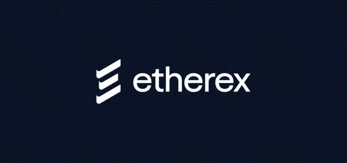

# Etherex Adoption Analysis
Beyond Volume Metrics - Tracking real activity metrics on Linea's fastest-rising Decentralised Exchange (DEX)

## Table of Contents

1. [Introduction](#introduction)
2. [Dashboard Overview](#dashboard-overview)
3. [Methodology](#methodology)
4. [Key Insights](#Key-insights)
5. [Challenges](#challenges)
5. [Resources & References](#resources--references)
  
## 1. Introduction
### Project Overview

Welcome to the Etherex Dashboard, a comprehensive analytics tool examining genuine user engagement on Etherex, Linea's native DEX, while filtering out bot manipulation and vanity metrics.

#### Why Linea & Etherex
**Linea**: ConsenSys’ zkEVM rollup has seen rising TVL, reflecting increased usage, though revenue and fees remain modest. This mixed picture makes Linea an interesting ecosystem to examine adoption quality and user activity.

**Etherex**: One of the leading native DEXs on Linea by TVL and activity, Etherex stands out for its innovative tokenomics and trading ecosystem.

#### What Makes Etherex Unique
* 100% fee distribution → All trading fees to stakers
* 100% liquidity rewards → All rewards goes to Liquidy Providers, no team cuts
* REX flywheel → LPs earn REX → Stake as xREX for governance + fee sharing

This analysis explore real, actionable metrics in a fast-growing ecosystem, providing insights into both protocol health and broader L2 adoption trends.

Sources: [Blockworks](https://blockworks.co/news/linea-previews-eth-first-roadmap) / [Cointelegraph](https://cointelegraph.com/news/consensys-launches-linea-zk-evm-to-scale-ethereum) / [DefiLlama](https://defillama.com/protocol/dexs/etherex) / [Etherex Twitter](https://x.com/etherexfi/status/1947132627737309399)

## 2. Dashboard Overview
The Etherex Dashboard provides a structured view of the protocol’s performance within the Linea ecosystem. Charts are created for different stakeholder audiences — **Protocol Teams, Advisors, and Users** — to deliver actionable insights.

Data is sourced from **Dune Analytics** and presented with a balance of technical accuracy and strategic interpretation.

| Dashboard Sections    | Charts                                                       | Audience / Purpose |
| -------------------- | ------------------------------------------------------------ | ------------------ |
| Protocol Performance | Daily REX Staking, Emission Effectiveness, Staking-to-Swap   | Protocol Teams     |
| User Behaviour        | User Quality Analysis, User Leaderboard                      | Advisors / Users   |
| Trading & Adoption   | Top Trading Pairs, Etherex Adoption & Sustainability Metrics | Advisors / Users   |

---

You can access the full dashboard [here](https://dune.com/kukumaster/etherex).

### Chart Descriptions

- **Daily REX Staking** – Monitors staking adoption and conversion to xREX. Useful for protocol teams to assess incentive uptake.  
- **Emission Effectiveness** – Compares staking to DEX activity to measure incentive efficiency. Mainly for protocol teams.  
- **Staking-to-Swap Time Lag** – Tracks how quickly staking translates into swaps, showing incentive effectiveness. Protocol-focused.  
- **User Quality Analysis** – Distinguishes real vs. bot users, useful for subscribers and protocols to understand genuine adoption.  
- **User Leaderboard** – Ranks users by activity and volume; relevant for subscribers and protocol teams tracking engagement.  
- **Top Trading Pairs by Activity Score** – Shows the most active trading pairs; mainly for protocol teams to monitor liquidity.  
- **Etherex Adoption & Sustainability Metrics** – Aggregated adoption, retention, and sustainability indicators; valuable for advisors, protocol teams, and users.

---

By structuring the dashboard around Etherex stakeholders and ecosystem context, the data serves internal teams, external advisors, and end-users alike, making it easier to connect operational mechanics with strategic growth signals.

## Methodology
This section explains how data is collected, processed, and analyzed, and how the metrics in the Etherex Dashboard are defined.

### 1. Data Collection Process
Data is sourced from Dune Analytics and websites (Twitter posts, Block explorer)? Maybe I will add API too...

#### Main Contract Addresses:
`0xefd81eec32b9a8222d1842ec3d99c7532c31e348` - REX token 
`0xc93B315971A4f260875103F5DA84cB1E30f366Cc` - xREX Staking
`0x5C1Bf4B7563C460282617a0304E3cDE133200f70` - WETH/REX DEX POOL

#### Processing & Filtering:
 - ERC‑20 token transfers filtered by amount and sender (ignoring null addresses).
 - Bot/farmer detection using thresholds for transaction frequency, activity span, and average transfer size.
 - Aggregation by wallet, day, and activity type.

#### Metrics Aggregation:
 - Token transfers → total sent, average transfer size, unique counterparties, activity span.
 - DEX swaps → trade counts, active days, pairs traded, activity span.

### 2. Chart & Analysis Logic

| Chart                                     | What it Measures                          | Purpose / Relevance            | Metrics Used                                                                                       | Notes / Caveats                                    |
| ----------------------------------------- | ----------------------------------------- | ------------------------------ | -------------------------------------------------------------------------------------------------- | -------------------------------------------------- |
| Daily REX Staking                         | Total staked REX per day                  | Monitor staking adoption       | `daily_staked`, `staking_transactions`                                                             | Shows scale of incentive participation             |
| Emission Effectiveness                    | How staking correlates with DEX activity  | Measure incentive efficiency   | `unique_daily_stakers`, `unique_daily_traders`, `trader_to_staker_ratio`, `swaps_per_staked_token` | Higher ratios indicate incentives driving trading  |
| Staking-to-Swap Time Lag                  | Time between staking and swap per user    | Evaluate speed of engagement   | `min_time_lag`, `median_time_lag`, `p90/p99_time_lag`                                              | Reflects user responsiveness to staking incentives |
| User Quality Analysis                     | Real vs. bot users                        | Distinguish genuine adoption   | Classification based on activity span, transaction counts, avg transfer size, burstiness           | Highlights sustainable vs inflated participation   |
| User Leaderboard                          | User ranking by activity and volume       | Identify top contributors      | `total_sent`, `total_trades`, `active_days`                                                        | Useful for monitoring high-value participants      |
| Top Trading Pairs by Activity Score       | Most active pairs on Etherex              | Monitor liquidity distribution | `trade_count`, `activity_score`                                                                    | Indicates concentration vs diversified trading     |
| Etherex Adoption & Sustainability Metrics | Aggregated adoption and retention metrics | Macro-level protocol health    | `unique_users`, `active_days`, `total_volume`                                                      | Combines engagement and economic activity          |

Notes

The methodology is designed to balance economic significance and behavioral activity.

Metrics and classifications (e.g., Dust Bots, High-Frequency Bots) are chosen to reflect genuine participation and incentive effectiveness.

### SQL Queries & API Scripts

## Key Insights

## Challenges
until the ABI for that contract is decoded, we can’t calculate actual fee amounts from the logs.
Decoded Event Data is Missing
Many of the newer contracts (e.g., FeeCollector, Pair contracts) are not yet decoded by Dune.
Key numeric fields such as amount, arg0, or token-specific data are unavailable.
Queries relying on bytearray_to_uint256 or arg0 fail or return 0 values.
Contract ABIs Not Fully Integrated
Without the ABI, we can only access general log metadata (block time, tx hash, event name).
Calculating USD value of swaps, fee payouts, or token transfers is impossible until ABI decoding is complete.
Challenges with Etherex:
Very Recent Launch - Limited historical data (only ~28 days in our database). Etherex Dune tables don’t provide USD amounts because the logs are not decoded.
Sustainability Questions - Recent growth may be unsustainable

Workarounds Implemented
Event Counting Instead of Volume. For fee-related charts, we track the number of FeesCollected events and unique collectors. This provides a proxy metric for activity, even without numeric fee amounts. 
I tired a Python-based solution that decodes the raw logs using the known ABI of Swap events. This shows Data sourcing & independence: I am identifying missing data and figuring out alternative ways to get it.
Problem-solving: I am using Python to reconstruct USD volumes when the SQL source is incomplete.
Current Status – xREX Fee Earnings
Available metric: Weekly counts of FeesCollected events across all FeeCollector contracts.
Unavailable metrics: Actual amounts of fees in REX tokens. The event data is not decoded yet.
Reason: New project, logs decoding not complete on Dune.
Workaround: Use event counts as a proxy for activity while waiting for decoded data. Once Dune exposes amount or value in decoded logs, the query can be upgraded to sum fee amounts per week.

## Resources
[Blockworks](https://blockworks.co/news/linea-previews-eth-first-roadmap) |
[Cointelegraph](https://cointelegraph.com/news/consensys-launches-linea-zk-evm-to-scale-ethereum) |
[DefiLlama](https://defillama.com/protocol/dexs/etherex) |
[DEXScreener](https://dexscreener.com/linea/0x5c1bf4b7563c460282617a0304e3cde133200f70) |
[Dune Docs](https://docs.dune.com/home) |
[Etherex Docs](https://docs.etherex.finance/) |
[Linea Docs](https://docs.linea.build/technology/canonical-token-bridge) |
[Linea official](https://linea.build/) |
[Linea Block Explorer](https://lineascan.build/) 

